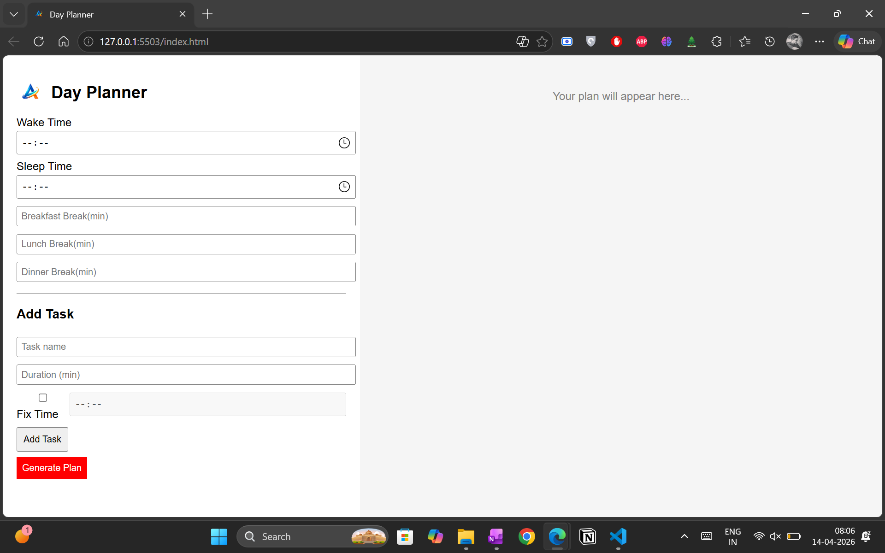

# Day Planner

## Overview
This project is a step forward from basic UI-based applications, in which I focused on building a more functional, logic-driven tool.

The Day Planner helps users organize their daily schedule by considering wake time, sleep time, breaks, and tasks. It generates a structured plan for the day.

## Features
- Set wake-up and sleep time
- Add breakfast, lunch, and dinner breaks
- Add tasks with duration
- Option to fix a task at a specific time
- Automatically generate a daily schedule
- Handles time gaps intelligently between tasks

## Tech Stack
- HTML
- CSS
- JavaScript

## What I Learned
- Handling time inputs and calculations
- Managing multiple dynamic inputs
- Building logic to generate schedules
- Improving UI structure compared to earlier projects

## Screenshots

## How to Run
1. Clone or download this repository
2. Open `index.html` in your browser

## 📌 Project Level
Beginner

## Note on Logo Usage
The logo used in this project is my personal brand identity.  
It is included only for demonstration purposes and should not be reused, redistributed, or used in other projects without permission.

## Growth Note
In this project, I moved beyond simple input-output applications and started focusing on building structured logic and user-driven workflows.
